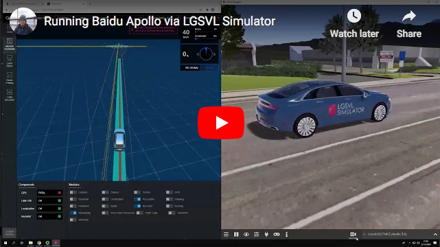
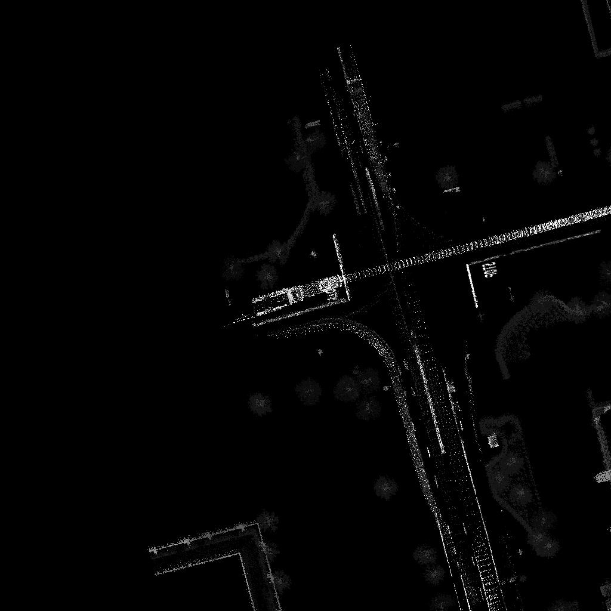
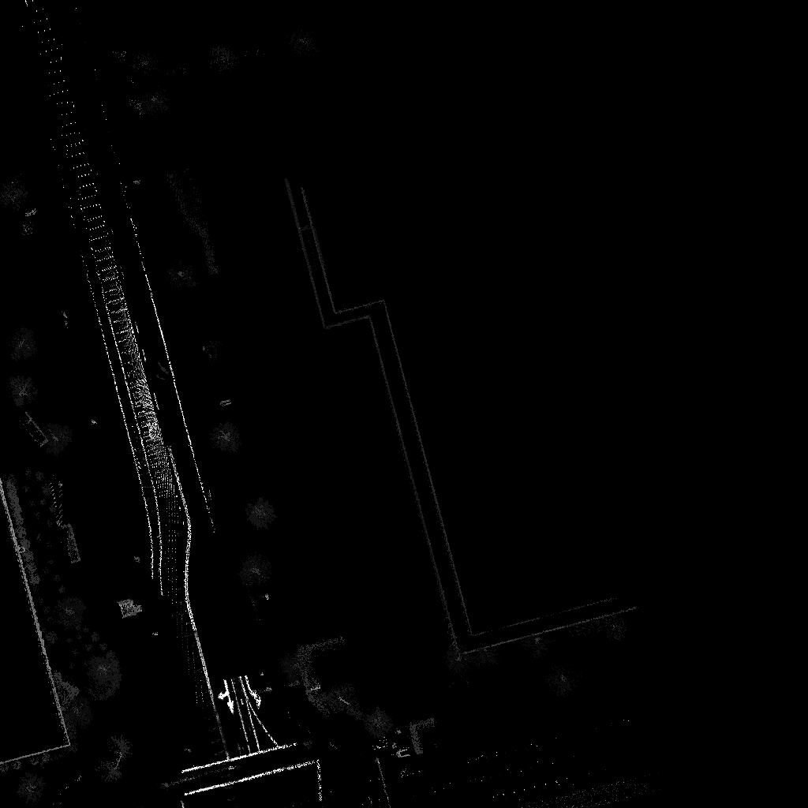

# Autonomous Vehicle Project 2020

## General Information

This repository contains a review of what we learned through [Autonomous Vehicles Project](https://courses.cs.ut.ee/2020/AutVehProj/fall/Main/Track-ADL) course provided by the University of Tartu

## Experiments by

- Jan Aare Van Gent
- Navid Bamdad Roshan
- Romet Aidla
- Tetiana Shtym
- Enlik

## Authors

- Tetiana Shtym
- Enlik
- Navid Bamdad Roshan

## Software Stack

- Baidu Apollo v5.5+ (`git clone` from [here](https://github.com/ApolloAuto/apollo))
- LGSVL Simulator (documentation from [here](https://www.lgsvlsimulator.com/docs/))
- Docker Engine (documentation from [here](https://docs.docker.com/engine/install/ubuntu/))

## Prerequisites

- Ubuntu 16.04 or later (Ubuntu 18.04 is preferred)
- Nvidia graphics card (required for Perception)
- Nvidia proprietary driver (>=410.48) must be installed
- Docker 19.03+

<br>
<br>

## Installation

Following tutorial from [Apollo github page](https://github.com/ApolloAuto/apollo/blob/master/docs/specs/prerequisite_software_installation_guide.md)

### NVIDIA GPU Driver

```
sudo apt-get update
sudo apt-add-repository multiverse
sudo apt-get update
sudo apt-get install nvidia-driver-440
```

Type `nvidia-smi` to check if NVIDIA GPU Driver works fine

### Docker Engine

- Apollo 6.0+ requires Docker 19.03+ to work properly
- Follow this [tutorial](https://docs.docker.com/engine/install/ubuntu/)

### NVIDIA Container Toolkit

```
distribution=$(. /etc/os-release;echo $ID$VERSION_ID)
curl -s -L https://nvidia.github.io/nvidia-docker/gpgkey | sudo apt-key add -
curl -s -L https://nvidia.github.io/nvidia-docker/$distribution/nvidia-docker.list | sudo tee /etc/apt/sources.list.d/nvidia-docker.list
sudo apt-get -y update
sudo apt-get install -y nvidia-container-toolkit
```

Restart Docker daemon for the changes above to take effect.
`sudo systemctl restart docker`

<br>
<br>

## Apollo Setup

- clone the repository `git clone https://github.com/ApolloAuto/apollo`
- launch the container and mount a few volumes `./docker/scripts/dev_start.sh`
- enter the container `./docker/scripts/dev_into.sh`
- build apollo `./apollo.sh build_opt_gpu` (optimized, not debug, with GPU support) (this will take some time)
- **NOTE** to build just a specific part of the apollo run `./apollo.sh build_opt_gpu [desired module]`
  - Ex: `./apollo.sh build_opt_gpu canbus`

**NOTE** The Apollo build may fail on machines with less than 1GB of RAM per CPU core due to aggressive parallelization in the build, as discussed in [Apollo issue 7719](https://github.com/ApolloAuto/apollo/issues/7719).

**NOTE** To stop the Apollo, run following command outside the docker container `./docker/scripts/dev_start.sh stop`

<br>
<br>

## LGSVL Simulator Setup

- Create a Simulation the `BorregasAve` map and `Lincoln2017MKZ` vehicle
- Enter `localhost:9090` as the Bridge Connection String
- (Optional) Enable Traffic and Pedestrians
- (Optional) Set the Time of Day and weather settings
- Submit the Simulation
- Select the created Simulation and click "Play"

<br>
<br>

## Running Apollo on LGSVL Simulator

- Launch the container and mount a few volumes `./docker/scripts/dev_start.sh`
- Enter the container `./docker/scripts/dev_into.sh`
- Activate dreamview `./scripts/bootstrap_lgsvl.sh`
- Activate the bridge `./scripts/bridge.sh`
- Open Apollo Dreamview in a browser by navigating to `localhost:8888`
- Select the `Mkz Lgsvl` setup mode, from the menu to the left of the vehicle menu
- Select the `Lincoln2017MKZ LGSVL` vehicle and `Borregas Ave` map in the top right corner
- Open the **Module Controller** tap (on the left bar)
- Enable **Localization**, **Transform**, **Perception**, **Traffic Light**, **Planning**, **Prediction**, **Routing**, and **Control**
- Navigate to the Route Editing tab
- Select a destination by clicking on a lane line and clicking Submit Route
- Watch the vehicle navigate to the destination
- More instructions from [here](https://www.lgsvlsimulator.com/docs/apollo-master-instructions/)

### Sample Demonstration Video

[](https://www.youtube.com/watch?v=adaWOz_d0tM)

<br>
<br>

## Start/Stop modules using command line

- To start a module type `./scripts/<module_name>.sh start`
  - Ex: `./scripts/control.sh start`
- To stop a module type `./scripts/<module_name>.sh stop`
  - Ex: `./scripts/control.sh stop`

<br>
<br>

## Monitoring in Apollo

### Monitoring the topics of sensors and modules

- Run `./cyber_monitor` from the `/apollo` directory to list all the topics of sensors and modules of Apollo

### Monitoring the list of running modules and nodes

- Run `./cyber_node list` from the `/apollo` directory to list all the running modules and nodes

### Visualizing the output of the sensors

- Run `./cyber_visualizer` from the `/apollo` directory to visualize the outputs of the sensors like Camera and Lidar

<br>
<br>

## Record sensor data

- Run `cyber_recorder record -c <channel_names>` to record the data of desired channels
  - Ex:
    ```
    cyber_recorder record -c /apollo/sensor/lidar128/compensator/PointCloud2 /apollo/sensor/gnss/odometry
    ```
  - **NOTE** Channel names can be found using `./cyber_monitor`
- To record the data of all channels, run `cyber_recorder record -a`
- Now drive around in the simulator
- To stop recording, press `Ctrl+C`
- You can find recordings in `apollo/` directory

<br>
<br>

## Generate Local Map

### Record Point Cloud, Odometry, and Pose

- Make sure you receive messages through following 3 channels by running `./cyber_monitor` (topics should be green)
  - `/apollo/sensor/lidar128/compensator/PointCloud2`
  - `/apollo/sensor/gnss/odometry`
  - `/apollo/localization/pose`
- run this command to start recording
  ```
  cyber_recorder record -c /apollo/sensor/lidar128/compensator/PointCloud2 /apollo/sensor/gnss/odometry /apollo/localization/pose
  ```
- Start driving around in LGSVL simulator
- Press `CTLR+C` to stop the recording
- The recorded data files will be available at `/apollo/recording`

### Generate Map

### Method 1 (using msf_simple_map_creator.sh)

- To create map, run the following command inside docker container. `DATA_PATH` is the path to recorded data (`./apollo` by default). And `OUT_FOLDER_PATH` is the path to store the created map.
- Run:

  ```
  /apollo/scripts/msf_simple_map_creator.sh <DATA_PATH>/recording/ /apollo/modules/calibration/data/Lincoln2017MKZ_LGSVL/velodyne_params/velodyne128_novatel_extrinsics.yaml 10 <OUT_FOLDER_PATH>
  ```

  - Ex:
    ```
    /apollo/scripts/msf_simple_map_creator.sh /apollo/recording/ /apollo/modules/calibration/data/Lincoln2017MKZ_LGSVL/velodyne_params/velodyne128_novatel_extrinsics.yaml 10 /apollo/outmap
    ```

- **NOTE**: If you have error with parsing the lidar point clouds from the LGSVL simulator, refer [here](https://github.com/ApolloAuto/apollo/issues/11936)

- Image output example
  

  <br>

  

### Method 2 (using Run msf_local_map_creator.sh)

#### 1. Extract point clouds

- Extract Point Cloud from recording file using `msf_recorder_parser.sh`
- `DATA_PATH` is the path to recorded data (`./apollo` by default). And `OUTPUT_FOLDER` is the path to store the extracted point clouds.
  ```
  /apollo/scripts/msf_record_parser.sh [DATA_PATH] [OUTPUT_FOLDER]
  ```
  - Ex:
    ```
    scripts/msf_record_parser.sh /apollo/recording/ /apollo/recording/output/
    ```
- You can find point clouds in /apollo/recording/output/ folder

#### 2. Interpolate Poses

- Pose interpolation fixes the pose file, such that the location and timestamps of the locations match LiDAR scans. **To interpolate poses**, type the following:
  ```
  /apollo/scripts/msf_poses_interpolator.sh [input_poses_path] [ref_timestamps_path] [extrinsic_path] [output_poses_path]
  ```
  - Ex:
    ```
    /apollo/scripts/msf_poses_interpolation.sh /apollo/recording/output/00000/pcd/fusion_loc.txt /apollo/recording/output/00000/pcd/pcd_timestamp.txt /apollo/modules/calibration/data/Lincoln2017MKZ_LGSVL/velodyne_params/velodyne128_novatel_extrinsics.yaml /apollo/recording/output/00000/pcd/inter_loc.txt
    ```
  - Repeat the same for `/apollo/recording/output/00001`, `/apollo/recording/output/00002` etc

#### 3. Run `msf_local_map_creator.sh`

- Run following command to create the local map using extracted point clouds and interpolated poses
  ```
  scripts/msf_local_map_creator.sh [pcd folder] [pose file] [zone id] [map folder]
  ```
  - Ex:
    ```
    scripts/msf_local_map_creator.sh /apollo/recording/output/00000/pcd/ /apollo/recording/output/00000/pcd/inter_loc.txt 10 /apollo/recording/outmap
    ```
  - Repeat the same for `/apollo/recording/output/00001`, `/apollo/recording/output/00002` etc.
  - Output at `/apollo/recording/outmap/lossy_map`

<br>
<br>

## Record The Waypoints of a Trajectory and Replay it

### Record

- Run the LGSVL Simulator
- Connect to simulator using `./scripts/bridge.sh`
- Setup and run rtk_recorder.sh

  ```
  ./scripts/rtk_recorder.sh setup
  ./scripts/rtk_recorder.sh start
  ```

- Drive around in the simulator to record waypoints. When you finish, press `Ctrl + C`.
- The recorded waypoints are stored in the `/apollo/data/log/garage.csv`

### Replay the record

- Put the car into initial location, by press `F12` in simulator
- Run following to start rtk_player

  ```
  ./scripts/rtk_player.sh setup
  ./scripts/rtk_player.sh start
  ```

- Run following to stop
  ```
  ./scripts/rtk_player.sh stop
  ./scripts/control.sh stop
  ```

<br>
<br>

## [Run Apollo on LEXUS](./testing_on_lexus_car/README.md)
